# Parser Construction and Runtime Behavior

This document explains how the two baseline parsers are built and how they behave at runtime:

- Rule-based parser: `baselines/rule_based.py`
- CRF parser: `baselines/crf_model.py`

It is implementation-driven and matches the current code.

## 1. Shared Input and Output Contract

Both parsers produce the same structure:

```json
{
  "include": {"key": ["value1", "value2"]},
  "exclude": {"key": ["value1"]}
}
```

The benchmark and evaluation flow treat each `(polarity, key, value)` as a structured pair.

## 2. Rule-Based Parser

## 2.1 What Is Learned in `fit`

The rule-based parser is deterministic at inference, but it still uses train+val data to build lexical resources:

1. Collect canonical values per key from `include` and `exclude`.
2. Mine extra surface forms from BIO spans when a span can be unambiguously mapped to one canonical value.
3. Inject type aliases (`TYPE_ALIASES`) only for types that exist in the current dataset.
4. Build phrase variants (`default_phrase_variants`) and normalize text for matching.
5. Build `PhraseMatcher` patterns for every `(key, canonical_value)` pair.
6. Build semantic expansion (`SEMANTIC_HINTS`) filtered by values that really exist in the folder-specific schema.

Main internal tables:

- `known_values_by_key`
- `surface_forms_by_pair`
- `match_id_to_pair`
- `semantic_expansion`

## 2.2 Inference (`parse`)

Given a query:

1. Run spaCy pipeline (`load_nlp`).
2. Generate candidate matches from:
   - `PhraseMatcher` spans
   - token-level semantic hints (for words such as `dark`, `light`, `warm`, `cool`)
3. For each candidate span, classify polarity with `_is_negated`:
   - local left-window negation check (up to 4 tokens)
   - dependency-based checks (`neg` relation and negation among children/head siblings)
4. Aggregate into sorted unique `include` and `exclude` lists per key.

## 2.3 Rule-Based Strengths and Limitations

Strengths:

- Fast and deterministic.
- Easy to inspect and debug.
- Uses explicit lexical and semantic resources.

Limitations:

- Depends heavily on lexical coverage and alias quality.
- Complex negation scope can still be hard for fixed heuristics.
- Semantic hints are hand-curated and intentionally small.

## 2.4 Export/Reload Support

`to_export_state()` stores:

- parser type
- spaCy model metadata
- known values
- surface forms
- semantic expansion
- negation words
- alias/hint config

`from_export_state()` reconstructs matcher state and semantic expansion, then marks parser as fitted.

## 3. CRF Parser

## 3.1 What Is Learned in `fit`

CRF training has two layers:

1. Sequence model training (`sklearn-crfsuite`), using train BIO labels.
2. Lookup table construction from train+val for robust value normalization at inference.

The value lookup layer builds:

- `known_values_by_key`
- `surface_to_keys` (single-token lexicon hints)
- `variant_to_canonical` (surface form -> canonical value)

It also injects `TYPE_ALIASES` where applicable.

## 3.2 Feature Engineering

Per-token feature groups in `_token_features`:

- Lexical: lower, lemma, prefix/suffix, shape
- Linguistic: POS, tag, dependency
- Token type: digit/punct flags
- Lexicon: in-schema indicator and candidate keys
- Negation: token-level and local-window negation signal
- Context: previous/next token lower/POS/dep
- Position: BOS/EOS flags

## 3.3 Training Procedure

1. Normalize labels for training (`-X` stripped; keep `NEG`, `O`, BIO tags).
2. Build train/val feature matrices and label sequences.
3. Grid-search over regularization pairs:
   - default grid: `{"c1": 0.1, "c2": 0.1}`, `{"c1": 0.01, "c2": 0.01}`
4. Select best model by validation weighted F1 over non-`O` labels (fallback to token accuracy when needed).

## 3.4 Inference (`parse`)

Given a query:

1. Predict BIO/NEG sequence with CRF.
2. Convert labels to spans.
3. Resolve each span text to canonical value via `_resolve_value`:
   - exact normalized variant lookup
   - fuzzy fallback (`difflib.get_close_matches`, cutoff `0.82`)
   - canonical normalization fallback
4. Detect negation:
   - predicted `NEG` near span, else
   - lexical negation in nearby tokens
5. Build `include` / `exclude` output.

## 3.5 CRF Strengths and Limitations

Strengths:

- Learns contextual patterns from labels.
- Usually better generalization than strict lexical rules.
- Still interpretable compared to deep black-box models.

Limitations:

- Requires labeled BIO data quality to be good.
- Value resolution still relies on lookup tables and fuzzy matching heuristics.
- Sequence model can be sensitive to annotation noise.

## 3.6 Export/Reload Support

CRF export is split across two artifacts:

- parser state (`parser_state.json`): lookup tables + parser config
- trained CRF object (`crf_model.pkl`)

`CRFParser.from_export_state(..., model=...)` reattaches the trained model and restores lookup tables.

## 4. Practical Difference Between the Parsers

- Rule-based focuses on explicit phrase and negation heuristics.
- CRF focuses on sequence labeling, then canonical value resolution.

Both are benchmarked with the same structured metrics and can be exported as winner artifacts for production use.

## 5. Visual Diagrams (Rule-Based and CRF)

The following diagrams are implementation-faithful and show both data flow and which model/component is used in each step.

### 5.1 Rule-Based Parser Diagram

```mermaid
flowchart TD
   subgraph RB_FIT[Rule-Based fit train + val]
      RB1[QueryExample train+val data]
      RB2[Collect canonical values per key include/exclude]
      RB3[Mine BIO spans for extra surface forms labels_to_spans]
      RB4[Inject type aliases TYPE_ALIASES]
      RB5[Generate phrase variants default_phrase_variants + normalise_for_match]
      RB6[Build PhraseMatcher patterns spaCy PhraseMatcher]
      RB7[Build semantic expansions SEMANTIC_HINTS filtered by known schema]
      RB8[Runtime resources known_values_by_key, surface_forms_by_pair, match_id_to_pair, semantic_expansion]

      RB1 --> RB2 --> RB3 --> RB4 --> RB5 --> RB6 --> RB8
      RB2 --> RB7 --> RB8
   end

   subgraph RB_PARSE[Rule-Based parse runtime]
      RQ[User query text]
      RNL[spaCy pipeline via load_nlp en_core_web_sm or fallback blank en]
      RC1[Candidate spans from PhraseMatcher]
      RC2[Candidate hints from semantic tokens dark/light/warm/cool]
      RM[Merge candidates into SpanMatch set]
      RN[_is_negated polarity decision left window + dependency checks]
      RO[Output FilterDict include and exclude]

      RQ --> RNL --> RC1 --> RM
      RNL --> RC2 --> RM
      RM --> RN --> RO
   end
```



### 5.2 CRF Parser Diagram

```mermaid
flowchart TD
   subgraph CRF_FIT[CRF fit train + val]
      C1[QueryExample train+val data]
      C2[Build lookup tables known_values_by_key, surface_to_keys, variant_to_canonical]
      C3[Inject type aliases TYPE_ALIASES]
      C4[Token feature extraction annotate_tokens via spaCy load_nlp]
      C5[Sequence model training sklearn_crfsuite.CRF algorithm lbfgs]
      C6[Hyperparameter search c1 c2 grid with validation weighted F1]
      C7[Trained artifacts CRF model pkl + parser_state json]

      C1 --> C2 --> C3
      C1 --> C4 --> C5 --> C6 --> C7
      C3 --> C7
   end

   subgraph CRF_PARSE[CRF parse runtime]
      CQ[User query text]
      CNLP[spaCy-based token annotations lexical + POS + dep]
      CFEAT[Per-token feature vector]
      CPRED[CRF predict labels BIO and NEG]
      CSPAN[labels_to_spans span extraction]
      CRES[_resolve_value exact variant map then difflib fuzzy cutoff 0.82 then canonical fallback]
      CNEG[Negation decision predicted NEG window OR lexical negation window]
      COUT[Output FilterDict include and exclude]

      CQ --> CNLP --> CFEAT --> CPRED --> CSPAN --> CRES --> CNEG --> COUT
   end
```



### 5.3 Model/Component Used at Each Step

#### Rule-Based

| Step | Model/Component | Purpose |
|---|---|---|
| Tokenization/parsing | spaCy `en_core_web_sm` (or `spacy.blank("en")` fallback) | Build doc/tokens for matching and dependency negation checks |
| Phrase matching | spaCy `PhraseMatcher` | Match normalized lexical patterns to `(key, value)` |
| Semantic expansion | `SEMANTIC_HINTS` mapping | Add controlled hint-based candidates |
| Negation | `_is_negated` heuristics + dependency relations | Decide include vs exclude polarity |

#### CRF

| Step | Model/Component | Purpose |
|---|---|---|
| Token annotations | spaCy `en_core_web_sm` (or blank fallback) via `annotate_tokens` | Generate lexical and linguistic features |
| Sequence labeling | `sklearn-crfsuite` `CRF` (`lbfgs`) | Predict BIO/NEG tags per token |
| Model selection | `sklearn_crfsuite.metrics` | Choose best `c1/c2` with validation weighted F1 |
| Value normalization | lookup tables + `difflib.get_close_matches` | Map span text to canonical schema values |
| Negation fusion | predicted `NEG` + lexical window checks | Decide include vs exclude polarity |